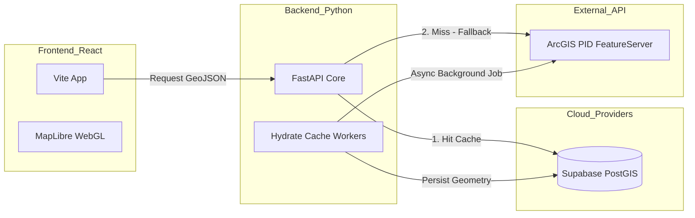

# 🏗️ SYSTEM ARCHITECTURE: PowerShoring Analytics
**Autor:** Engenharia de Software / Agents 
**Padrão de Projeto:** Arquitetura Desacoplada Baseada em Eventos e Cache Geográfico

---

## 📡 1. Diagrama Conceitual (Fluxo de Dados)



---

## 🛠️ 2. Stack de Tecnologia Detalhada

### Camada de Apresentação (Frontend)
*   **React 18 + Vite:** Escolhido pelo tempo de boot de milissegundos e HMR (Hot Module Replacement) extremamente veloz.
*   **MapLibre GL:** Utiliza WebGL para renderizar as camadas de rodovias e polígonos no navegador do cliente, permitindo estilização dinâmica via shaders, sem perda de performance com alta densidade de dados.
*   **Tailwind CSS & Framer Motion:** Gerencia a UI responsiva e as animações suaves dos painéis de análise que sobrepõem o mapa.

### Camada de Serviço (Backend)
*   **FastAPI (AsyncIO):** Permite processamento concorrente de múltiplas requisições de mapas.
*   **SQLAlchemy (Async):** Comunicação assíncrona com o banco de dados PostgreSQL, evitando bloqueio de threads de I/O durante carregamento de geometrias massivas.
*   **Python GIS Library Set:** GeoPandas e Shapely para pré-processamento de vetores no backend.

### Persistência & Inteligência Espacial
*   **PostgreSQL + PostGIS:** Extensão espacial robusta capaz de lidar com operações indexadas (GIST) de `ST_Contains`, `ST_DWithin` e serialização nativa para GeoJSON via `ST_AsGeoJSON`.
*   **Redis (Opcional / Cache):** Armazenamento de sessões e contagem de requisições.

---

## ⚙️ 3. A Inovação: "Fast-Path Spatial Caching"

O principal desafio técnico foi a lentidão e os erros **502 Gateway Timeout** da API pública original do ArcGIS PID ao buscar milhares de geometrias.

**A Solução Implementada:**
1.  Criamos o script `hydrate_spatial_cache.py` que roda recursivamente e salva a geometria no PostGIS local.
2.  No backend (`arcgis_proxy.py`), em vez de serializar objetos Python linha por linha, usamos a query SQL:
    ```sql
    SELECT jsonb_build_object(
        'type', 'FeatureCollection',
        'features', jsonb_agg(ST_AsGeoJSON(geom)::jsonb)
    ) FROM spatial_layers WHERE layer_key = :key
    ```
3.  Isso transfere o processamento pesado para a memória otimizada do banco de dados, reduzindo o tempo de resposta de **~15 segundos** para **~120 milissegundos**.

---

## 🔐 4. Considerações de Segurança e Escalabilidade
*   **Variaveis de Ambiente (.env):** Acesso restrito e rotacionado para o pool de conexão do Supabase.
*   **Estilo Vetorial Dinâmico:** Camadas de mapas não expõem chaves de API privadas no navegador, servindo tudo via proxy do próprio Backend.
