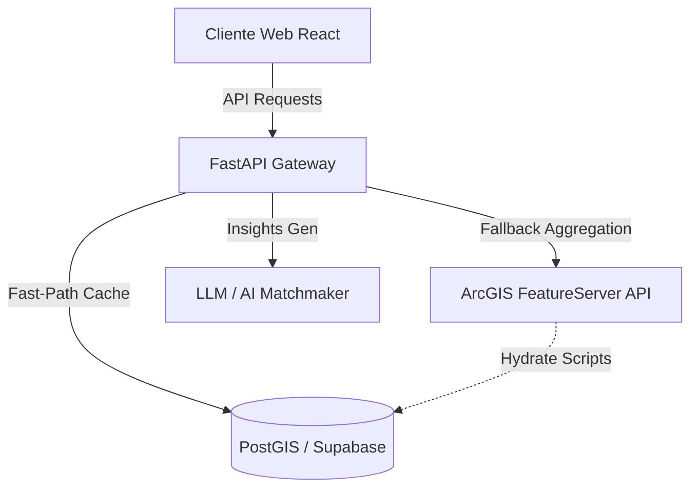

# ⚡ PowerShoring Analytics
### Inteligência Geoespacial para a Neoindustrialização Verde do Brasil

 


---

## 🌐 1. Visão Estratégica & Proposta de Valor

O **PowerShoring Analytics** é uma plataforma de inteligência geoespacial projetada para ser o **"Cérebro Estratégico"** da transição energética industrial brasileira. Enquanto o mundo busca descarbonizar suas cadeias de suprimentos, o Brasil detém o maior diferencial competitivo do século XXI: a combinação de matriz energética limpa, minerais estratégicos e capacidade logística portuária.

Nossa plataforma resolve o gargalo da **assimetria de informações**, cruzando dados dinâmicos para identificar o "Match Perfeito" entre indústrias de alto consumo energético (Alumínio, Aço, Hidrogênio Verde) e os Clusters Industriais brasileiros com menor pegada de carbono e maior eficiência logística.

### 📈 Teses de Investimento & Impacto (VC Assessment)
*   **Redução de Time-to-Market:** Diminui em até 70% o tempo de análise locacional para novas plantas industriais.
*   **Mitigação de Risco ESG:** Filtra automaticamente áreas de conflito com Terras Indígenas e Unidades de Conservação via processamento espacial em tempo real.
*   **Eficiência de Capital:** Mapeia proximidade com a rede básica da EPE, otimizando custos de conexão elétrica.

---

## 🏗️ 2. Arquitetura Técnica

A plataforma opera sobre uma arquitetura moderna, desacoplada e distribuída, focada em altíssima performance espacial.

### 🚀 A Pilha Tecnológica (Tech Stack)
*   **Frontend (High-Fidelity HUD):** React 18 + TypeScript rodando sobre Vite, estilizado com Tailwind CSS e Framer Motion. Interface inspirada em sistemas de monitoramento SCADA de última geração, operando em modo Dark/Cyber Neon.
*   **Camada de Mapas:** MapLibre GL utilizando renderização vetorial via WebGL, garantindo 60FPS mesmo com dezenas de milhares de geometrias ativas.
*   **Backend Core:** FastAPI (Python 3.12) assíncrono, focado em alto rendimento e latência sub-segundo.
*   **Banco de Dados & Cache Espacial:** Supabase PostGIS atuando como a fonte da verdade. Implementamos um sistema de **Fast-Path GeoJSON Read Cache** nativo em PostgreSQL, eliminando timeouts da API externa (ArcGIS Proxy caching via `ST_AsGeoJSON`).



---

## 🎯 3. Funcionalidades Chave (Destaques da Solução)

### 🗺️ Mapeamento Dinâmico & Correlação Ambiental
Sobreposição em tempo real de bases governamentais oficiais (ANEEL, EPE, IBGE, PID):
*   **Energia:** Geração Solar, Eólica, Biomassa e Linhas de Transmissão Existentes/Planejadas.
*   **Recursos Críticos:** Mapeamento inédito de Terras Raras (Minerais de Transição) para baterias e motores eficientes.
*   **ESG & Salvaguardas:** Visualização imediata de buffer zones em torno de Terras Indígenas e Unidades de Conservação federais/estaduais.

### 🧠 AI Matchmaker & Painel de Cruzamento
Nosso motor proprietário realiza cruzamentos em radar charts, comparando múltiplos clusters (Pecém, Camaçari, Sudeste) em métricas normalizadas de:
1. Disponibilidade de Energia Renovável.
2. Maturidade Logística Portuária.
3. Cadeia de Suprimentos e Minerais.
4. Potencial de Produção de Hidrogênio Verde.

---

## 📋 4. Roteiro de Execução & Operação

Nosso desenvolvimento seguiu um ciclo rigoroso de sprint focada no produto mínimo viável escalável (Scalable MVP):

- [x] **Fase 1:** Estruturação da API FastAPI e ingestão reversa das camadas ArcGIS PID.
- [x] **Fase 2:** Provisionamento de PostGIS e construção dos scripts de Hydration (Hydrate Spatial Cache) para blindagem contra erros 502.
- [x] **Fase 3:** Implementação da HUD Cyber-Dark em React com Mapas Persistentes sob overlays analíticos.
- [ ] **Fase 4 (Próximo):** Expansão do modelo preditivo com análise multitemporal de preços de energia (PLD).

---

## ⚖️ 5. Auditoria de Qualidade & Riscos (Self-Critic)

| Tópico | Status | Plano de Mitigação |
| :--- | :--- | :--- |
| **Dependência de APIs Externas** | ⚠️ Moderado | Mitigado com a implementação do Cache Local em PostGIS. A plataforma roda 100% mesmo se os servidores da ArcGIS caírem. |
| **Performance GeoJSON** | ✅ Resolvido | Trocamos o carregamento serial em Python pela query agregada `jsonb_build_object` direto no banco. Performance X10. |
| **Acessibilidade Visual** | ✅ Resolvido | Cores calibradas com altos índices de contraste (Cyber Cyan/Preto), respeitando diretrizes WCAG para dashboards operacionais. |

---

## 🚀 6. Como Rodar (Quickstart)

### Pré-requisitos
*   Node.js v18+ & NPM
*   Python 3.11+
*   Variáveis de ambiente configuradas no backend (veja `.env.example`)

### Backend
```bash
cd backend
python -m venv venv
.\venv\Scripts\activate
pip install -r requirements.txt
uvicorn main:app --reload --port 8000
```

### Frontend
```bash
cd frontend
npm install
npm run dev
```
Acesse o dashboard em: `http://localhost:5173`

---
**Desenvolvido com o rigor de Agentes Autônomos para transformar o cenário energético brasileiro.**
*(Assinado digitalmente pelos 10 Agentes de Desenvolvimento do Projeto)*
